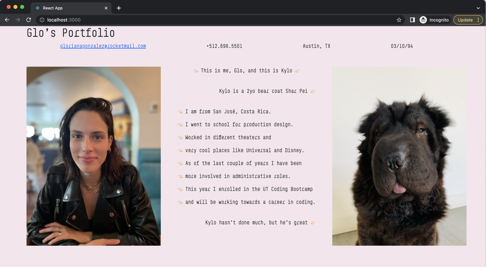
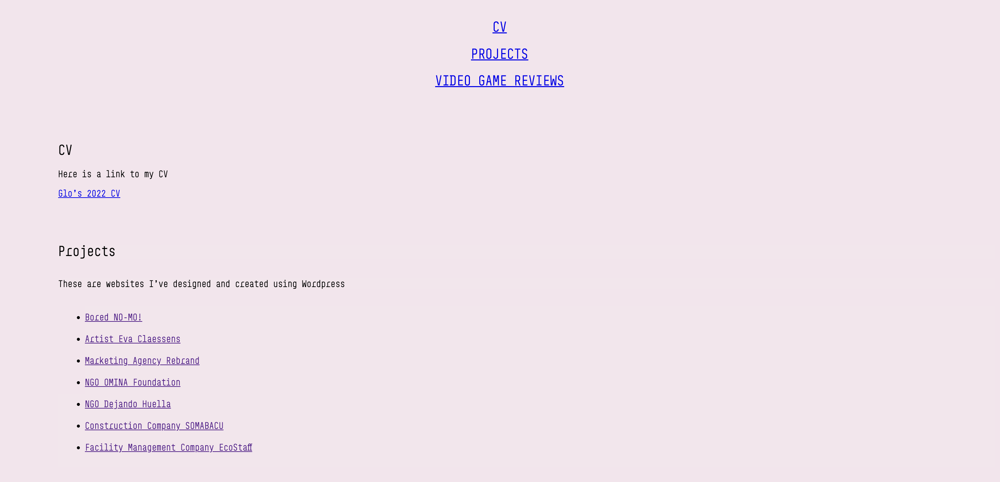
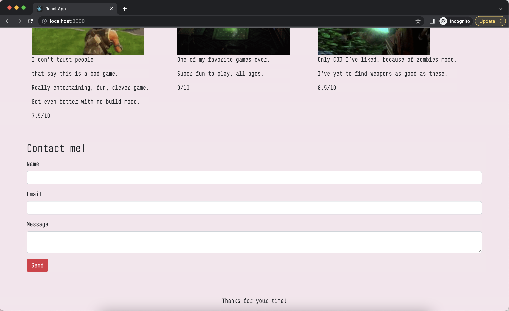

# React Portfolio
Deployed work portfolio in a single-page React app

# Description
I have replicated my orginal portfolio with React in order to showcase my understanding of elements and their functionality. 

# Usage 
- From the command line run `npm start`
- If your local host shows another application, open an incognito window and type `http://localhost:3000/`

# Links
- Deployed application: `https://blooming-plains-13551.herokuapp.com/`
- GitHub repo: `https://github.com/ggggglo/portfolio_react`

# Website Images

